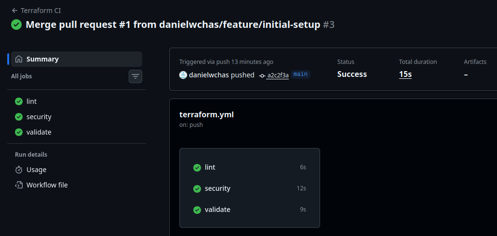

# Lab 1 Terraform
## Vad projektet gör
Projektet syftar till att deploya en VM automatiskt på GCP med Terraform. Det använder sig av Github Actions för att säkerställa att ändringarna testas innan de mergas till main.

## Hur man kör
Initialisera:
`terraform init`

Planera:
`terraform plan`

Vamos A L-Applya:
`terraform apply`

## Pipeline status
<p align="center">
  
</p>

## Säkerhetsbeslut
### UFW
Bästa brandväggen. Stoppar intrångsförsök. Man ska alltid ha en brandvägg om man är öppen mot internet.

### Fail2Ban
Stoppar spambots och folk som försöker ta sig in på servern automatiskt om de försöker spamma.

### Backup
I main.tf finns resursen `"google_compute_disk_resource_policy_attachment" "backup_attachment"`. Enligt medföljande policy görs en backup varje dag.

### Trivy
Automatisk säkerhetsscanning för att kolla att terraform-konfigurationen är okej.

### Ägandeskap
Om något händer kan vi direkt se vem som "äger" resursen. Det spelar inte så stor roll i den här labben för det är bara jag som kan göra fel, men det är användbart i produktionsmiljö.
```
 labels = {
   student = var.student_id
   course  = "devsecops-2026"
   lab     = "1"
 }
```

### VM i GCP Console
TODD OH